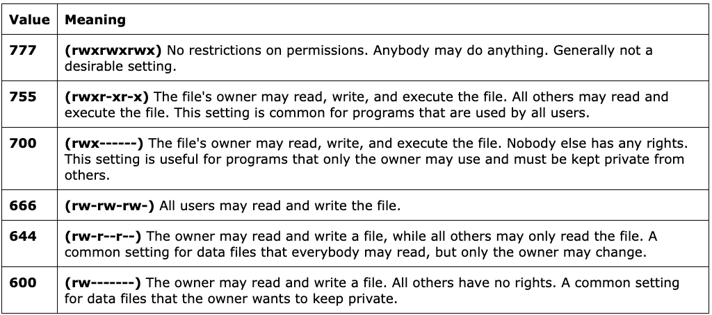

# Resources

[Permissions](http://linuxcommand.org/lc3_lts0090.php)

# Commands

    chmod
    sudo
    su
    chown
    chgrp
    id
    groups
    whoami
    adduser
    useradd
    addgroup

    rwx rwx rwx = 111 111 111
    rw- rw- rw- = 110 110 110
    rwx --- --- = 111 000 000

    and so on...

    rwx = 111 in binary = 7
    rw- = 110 in binary = 6
    r-x = 101 in binary = 5
    r-- = 100 in binary = 4

